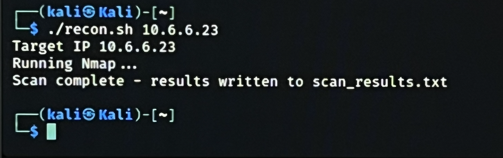

Automation Code Using Bash Script
Lab Overview

In this lab, I completed the following objectives:

Part 1: Write a Bash Script to Automate an Nmap Scan and Store the Results
Part 2: Differentiate between Scripts Written in Bash, Python, Ruby, and PowerShell

Creating scripts to automate these tasks reduces the time necessary to complete the penetration testing project.

Part 1: Bash Script Automation

In this section, I wrote a short script named recon.sh to perform a simple Nmap scan.

Target Availability Check

I first started with pinging the target host at 10.6.6.23 to ensure that it is available on the network.

Screenshot 1:

Results of running:ping -c5 10.6.6.23

Script Logic (if/then)

I used a mousepad text editor to create the script and implemented an if/then sequence.

Screenshot 2:

(Mousepad text editor showing the if/then sequence)

Automating the Nmap Scan

I edited the script to enter the commands that will run the Nmap scan, and the results of the Nmap will be written to a file named:

scan_results.txt

Screenshot 3:

(Script showing Nmap command and output redirection)

Script Execution

I ran the command:

./recon.sh 10.6.6.23

Screenshot 4:

(Execution of the script)

Reviewing Scan Results

I viewed the results of the scan_results.txt and discovered the six ports open as shown in the screenshot.

Screenshot 5:

(Scan results showing six open ports)

Script Modification (Enumeration)
As seen in the previous step, the target at 10.6.6.23mhas open ports that could indicate a samba server(ports 139 and 445 are open).
I modified the script to enumerate shares on the target to run enum4linux.

Screenshot 6: 

(Script updated to include enumeration)

Enumeration Results

I ran the command:

./recon.sh 10.6.6.23

I then viewed the results stored in the scan_results.txt file. The screenshot only captures the part that displays which files were found on the target.

Screenshot 7: 

(Output showing discovered files/shares)

Additional Automation Technique

I also familiarized myself with another way of how to automate Nmap by scanning a group of specific targets that are specified in an external file.

Part 2: Scripting Language Comparison

I finally took a look at various scripts written in Bash, Python, Ruby, and PowerShell and managed to differentiate between them:

Bash
Native to Linux/Unix systems
Ideal for system administration and command automation
Lightweight and fast for simple tasks

Python
Easy to read and write.
Extensive libraries for networking, security, and automation.
Widely used in penetration testing tools.
Also used in SIEM tools

Ruby
Known for its use in frameworks like Metasploit
Flexible and powerful for exploit development

PowerShell
Native to Windows environments
Strong for system administration and enterprise automation
Used heavily in Windows-based penetration testing
